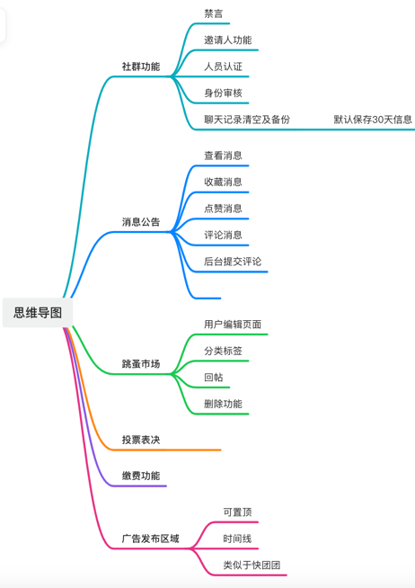

# 十里风和 App
成都中环TOD十里风和项目业主专用服务。

# 需求整理

1、2000+人社群沟通需求

2、小区官方信息发布渠道

3、小区内各种缴费渠道

4、小区内人群跳蚤市场

5、团购信息、便民信息共享

6、正式投票信息

# 方案设计

# 技术架构
- 后台技术采用Java

- 用户信息发帖等使用Neo4J实现；方便从社交、楼栋进行分类检索。

- 前端技术使用微信小程序及App

# 人员需求

-[x] 后端开发人员3名
-[ ] 前端开发人员2名
-[ ] 产品经理1名
-[ ] UI设计师1名